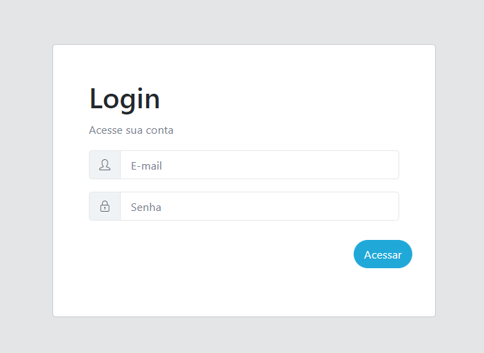
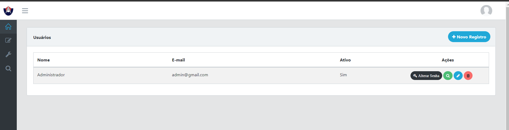
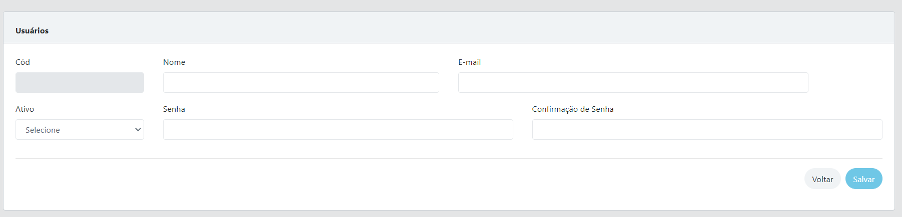
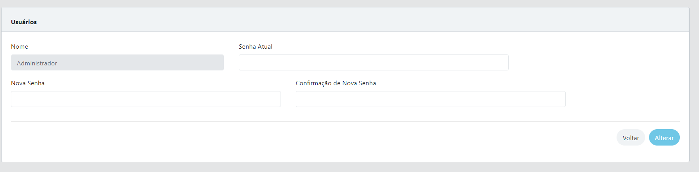
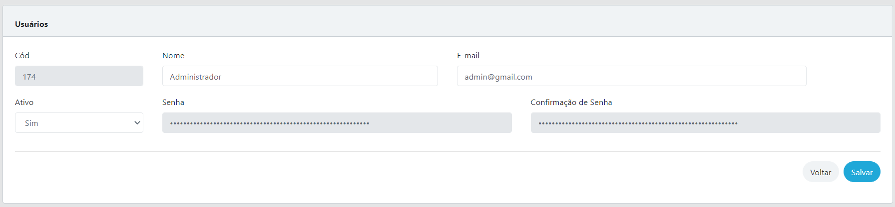
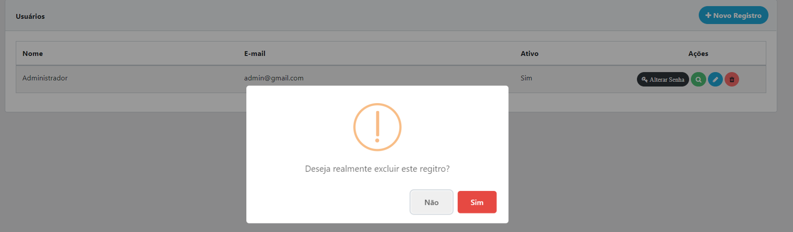

# Template para aplicações Angular

# Instalação
* Possuir Angular e Angular CLI instalado
* Possuir NodeJS instalado
* Clonar este reposítorio
* Executar os comandos:

```cmd
npm install
npm start
```
* Acessar: http://localhost:4200
# 

Consome API REST: https://github.com/williamsimionatto/laravel-api

#
## Login e autenticação


#
## Cadastro de Usuários
* Listagem de usuários já cadastrados

    
* Cadastrar novo usuário

    

* Alterar Senha de um Usuário

    

* Editar Usuário

    

* Excluir Usuário

     

# 
Template By: https://coreui.io/angular/